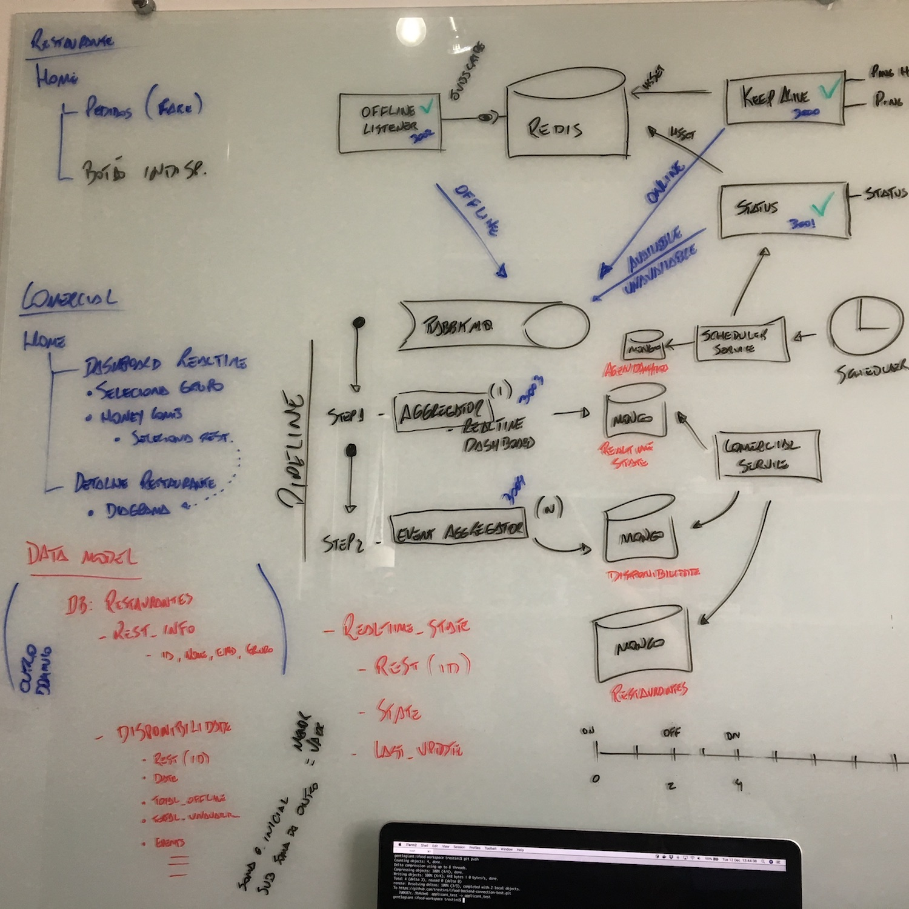

# Arquitetura

### Componentes estruturais

#### Redis

O Redis é um banco de dados chave-valor distribuído e de alta performance. Nessa solução, sua função é a de Hot Cache,
onde o estado de todas as conexões é persistido.

#### RabbitMQ

Message broker que recebe e distribui os eventos entre os demais componentes.

#### MongoDB

Banco de dados não relacional para armazenamento de documentos. Nessa solução, além de atuar como um banco de dados de
informações de negócio, ele mantém o estado do Cold Cache, usado para visualização de dados near-realtime.

### Serviços Backend

#### Keep Alive

O *keepalive-service* é o responsável por receber os *pings* do cliente e manter o hot cache atualizado com as 
informações sobre quem está online. Esse serviço não dispõe de API's de consulta e tem por característica alta 
performance e distribuição.

#### Status

O *status-service* é o componente que provê API's para consulta e alteração do status de um cliente em específico. Os
demais componentes da arquitetura deverão usar esse serviço para saber o status do clientes.

#### Offline Listener

O *offline-listener-service* é o componente responsável por receber o evento de expiração de dado do Redis e gerar o 
evento de OFFLINE para o restante do pipeline.

#### Event Aggregator

O *event-aggregator-service* é um dos passos do pipeline stream que agrega as informações no histórico de eventos.

#### Backend do Comercial

O *comercial-backend-service* tem duas responsabilidades (o que não é o ideal, mas só me dei conta disso agora ao 
escrever essa descrição): ele é parte do pipeline stream, recebendo os eventos e atualizando o cold cache para consulta
em tempo real dos status, e ele prove as informações para o frontend do comercial.

#### Scheduler

O *scheduler-service* foi desenhado para ser um agendador de tarefas a fim de implementar a funcionalidade de
agendamento da indisponibilidade, no entanto sua implementação não foi concluída.

### Frontends

#### Frontend do Restaurante (cliente)

Conceitualmente o *restaurant-frontend* é o frontend que o cliente (restaurante) usa para receber os pedidos da 
plataforma. Ele é o responsável por mandar os *pings* que o mantém o com o status de Online.

#### Frontend do Comercial

O *comercial-frontend* é o frontend onde o time comercial pode consultar em tempo real o status dos restaurantes, bem
como analisar o histórico.

# Funcionamento

### Fluxos

**Fluxo `keepalive`**

Quando um cliente (restaurant-frontend) efetua o login (fake nessa implementação), ele passa a chamar de tempos em 
tempos o backend que expõe através de uma API REST um endpoint de ping (keepalive-service). Este, por sua vez, é o 
responsável por gerencias as informações no cache (Redis) - caso o cliente já esteja no cache, seu timestamp é renovado. 
Caso contrário, uma entrada é inserida e marcada com a expiração configurada (15s para efeito de teste, parametro 
`__CACHE_RECORD_EXPIRATION_IN_SECS` em  [keepalive-service](https://github.com/trestini/ifood-backend-connection-test/blob/applicant_test/keepalive-service/app/routes/keepalive-http.js)), 
e um evento ONLINE é emitido para o broker.

**Fluxo `offline`**

Quando um registro é incluido no Redis, ele entra com um tempo de expiração. A cada *ping*, essa expiração é renovada.
Quando o registro ultrapassa o tempo de expiração o Redis emite um evento em sua fila internet PubSub informando que
determinada chave foi expirada. O *offline-listener-service* "escuta" essa fila e gera o evento OFFLINE que é emitido
para o broker.

**Fluxo `status_change`**

O serviço *status-service* é responsável por modificar o status de disponibilidade programada do cliente, e para tanto
ele expõe endpoints em uma API REST. Quando um cliente solicita a mudança de status (manual), ou uma mudança de status
é solicitada via scheduler (não implementado), este é atualizado no Redis e um evento com o status correspondente é 
gerado e emitido no broker.

### Pipelines

Quando um evento chega ao broker, ele é espalhado para duas filas, que são consumidas em paralelo. A primeira é a 
`STREAM_REALTIME_DASHBOARD`, e a segunda é a `STREAM_EVENT_AGGREGATOR`.

**Pipeline Step 1 - Dashboard realtime**

Ao consumir a fila `STREAM_REALTIME_DASHBOARD`, o *comercial-backend-service* atualiza o cold cache, que mantem o
estado corrente de cada restaurante para ser apresentado no dashboard realtime. A cada transição de status, o frontend
do comercial é notificado através de uma conexão websocket. 

**Pipeline Step 2 - Agregação** 

O processo de agregação consome a fila `STREAM_EVENT_AGGREGATOR` e consolida as informações de tempo online e offline
no registro persistente (MongoDB), que depois pode ser consultado como dado agregado pelo frontend-comercial.

# Racional das decisões de arquitetura

A arquitetura proposta para o problema em questão é baseada nos seguintes conceitos:

* Processamento distribuído
* Cache ativo e passivo (Hot and Cold cache)
* Desacoplamento através de mensageria
* Stateless
* Cloud native

As deciões de arquitetura dessa solução foram baseadas em três racionais:

* R1 - Os requisitos apresentados;
* R2 - O problema proposto;
* R3 - Proposição de soluções difentes das existentes.

#### MQTT, XMPP, AMQP x HTTP

De acordo como o proposto, fica claro que existe um requisito forte de escalabilidade por conta do número de 
restaurantes operando de maneira simultânea, bem como dos picos eventuais ("todo domingo a noite é um Black Friday").
Nesse sentido, o primeiro requisito fala sobre o uso de protocolos IoT (MQTT, XMPP e inclusão minha AMQP). O uso desse
tipo de protocolo nesse cenário representa alguns tradeoffs:

* Escalabilidade: a gestão de conexões persistentes faz com que a natureza elástica das arquiteturas distribuídas seja
mais complexa;
* Complexidade estrutural: seria necessário ter mais componentes no backend para trabalhar com diferentes protocolos
(broker do MQTT, fila ou listener para o caso do XMPP ou AMQP), além dos servidores HTTP que já deveriam existir 
para atender aos demais requisitos;
* Não é uma verdade universal mas geralmente o que justifica o uso de conexões persistentes é a possibilidade da
manutenção do estado cliente/servidor. Esse "estado" pode ser tão simples quanto uma tabela para saber quem é quem, 
ou um banco de dados inteiro para armazenar os dados de sessão do lado do servidor. No entanto, o uso do estado é 
obrigatório o que é um tradeoff natural para a escalabilidade.

A opção pelo uso de um cliente web-based contribui para a decisão do protocolo. Por mais que o HTTP seja um protocolo
considerado pesado, todo o ecossistema que o cicula é o que pode ser considerado mais estável e production-ready 
que temos disponível para uso. A adoção do protocolo é generalizada (widespread) manter um frontend web-based
simplifica drasticamente questões de distribuição e deployment. 

Uma solução baseada em protocolos IoT é totalmente viável, mas traz uma complexidade que ao meu ver só se 
justifica com um requisito explícito (no problema proposto essa conectividade iria apenas gerenciar o status do
restaurante através de keepalive/ping). No entanto, embora não tenha sido a decisão dessa implementação, eu posso supor
a existência de tais requisitos (e, como cliente do iFood eu só consigo pensar que quando eu faço o meu pedido e fico
ansiosamente esperando o restaurante confirmar, isso deve acontecer através de uma conexão persistente entre a 
plataforma e o restaurante). Em um cenário desse, essa conexão persistente seria o meio natural para se obter a
informação do status do restaurante. Na arquitetura proposta, a alteração necesária para esse requisito seria fazer o
*keepalive-service* ouvir um websocket e através desse meio de comunicação seria possível trafegar virtualmente 
qualquer protocolo (para me enturmar eu escolheria o AMQP[1],[2],[3], mas tendo fortemente a usar simples 
JSON na comunicação).

#### Cache

Sendo a escala um requisito fundamental, o uso de caches se torna mandatório. No entanto, usar informações 
centralizadas também é um tradeoff natural para a escala, portanto a decisão foi decompor o cache em quente e frio. O
cache quente é o que recebe as requisições diretamente do cliente, e é implementado pelo Redis, cujo use case principal 
é a manipulação de dados com base em chave-valor de maneira performática. O teste menciona o uso do Apache Ignite 
como cache, e em comparação com a arquitetura proposta, ele faria o papel do cache quente, sendo esta uma solução
completamente viável. A diferença entre os dois basicamente é:

* Leve: O Redis é um banco de dados que manipula dados em estrutura de chave-valor. Dada sua performance e escala, ele 
se assemelha à um cache. Para armazenamento de informações pequenas (um registro ou um status de conexão) ele é muito 
mais simples e leve do que um full-feature distributed cache[4] como o Ignite;
* Funcionalidades: O Redis possui a funcionalidade de expiração do registro e de gerenciamento interno de eventos. Em
conjunto, essas duas configurações permitem que um cliente escute uma fila que indica quando determinado registro foi
expirado sem a necessidade de codificar a integração. Esse recurso foi fundamental para a geração do evento de OFFLINE.
Muito embora seja possível fazer isso no Ignite, até com algumas vantagens (p/ex, o problema da duplicidade das 
mensagens);
* Cloud: Uma vez que a arquitetura foi planejada para uso em cloud, especificamente na AWS o Elasticache permite o usd
do Redis gerenciado.

#### Mensageria e gerenciamento de eventos

O broker de mensagaria escolhido foi o RabbitMQ. O racional principal para uso do Rabbit foi o meu conhecimento sobre
como ele funciona. Virtualmente qualquer outro broker leve poderia ser usado (StormMQ, ZeroMQ, HornetQ, p/ex). A única
consideração que eu faria seria uma comparação com o o Kafka: uma vez que os eventos são persistidos em dois outros
agregadores, a fila principal (no caso dessa implementação é a exchange KEEPALIVE_EVENTS) não necessita persistir as
mensagens. Nesse caso, inclusive, a KEEPALIVE_EVENTS é propositalmente não durável. Para esse caso, funcionalmente 
tanto o Kafka quanto o Rabbit fariam a mesma função, com a diferença de que o último é bem mais leve.

#### Banco de dados e persistência

Novamente a decisão pelo uso do MongoDB é particular por conta de proficiência. Não existe nenhum requisito funcional
que faça o MongoDB ser uma opção diferencial. No entanto a facilidade de uso e a proximidade com os conceitos de um
banco relacional fazem do MongoDB uma opção sempre viável. 

## Referências

1. https://blogs.vmware.com/vfabric/files/2013/02/MQTT_Header-300x264.png
2. AMQP com Websockets: https://alexfranchuk.com/blog/amqp-using-websockets/
3. AMQP no Ocean Observatory Initiative - 8TB/dia de dados: 
https://blogs.vmware.com/vfabric/2012/09/how-even-the-ocean-data-is-in-the-cloud.html
4. Casos de uso do Ignite: https://ignite.apache.org/usecases.html
